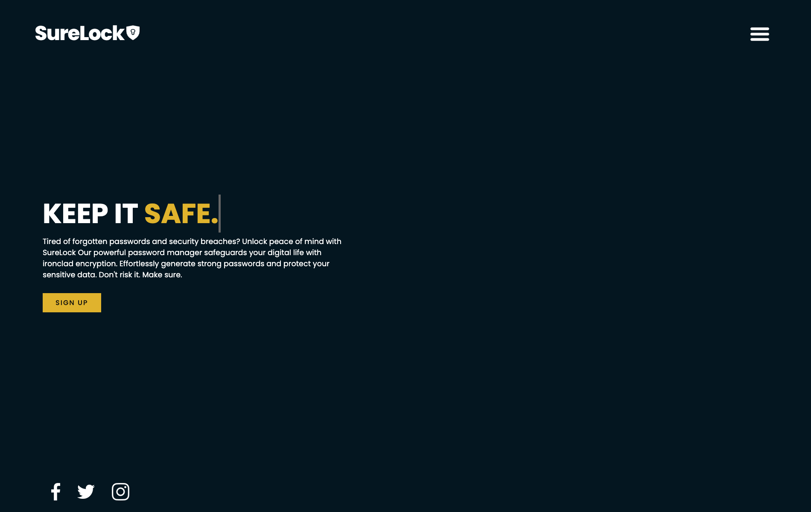
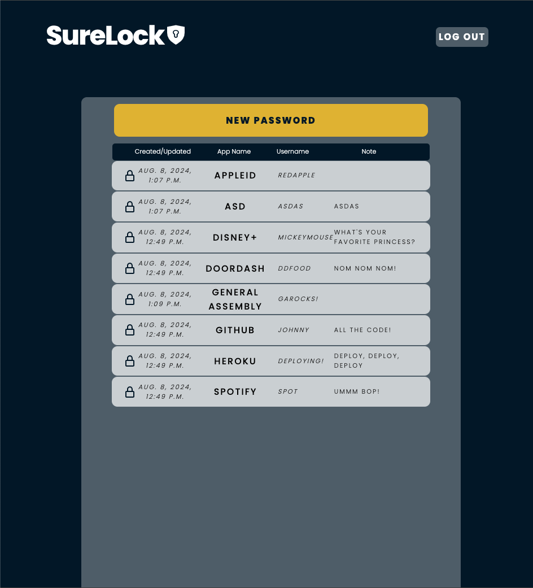
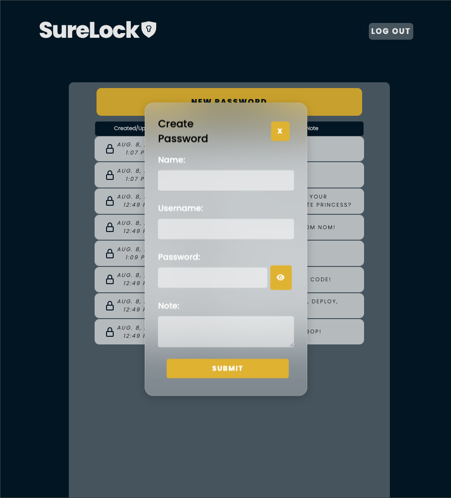
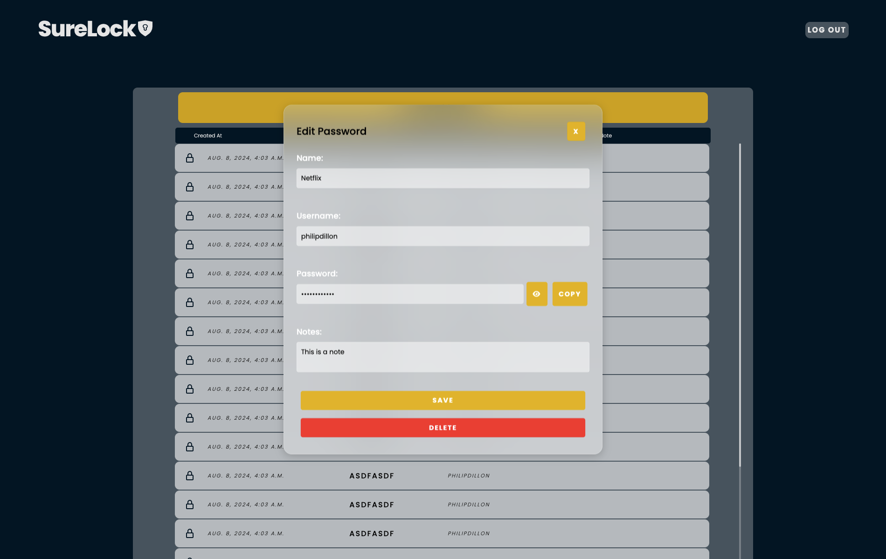

# SureLock

## App Description

SureLock is a secure, user-friendly password management application designed to help users store and manage their passwords efficiently. With SureLock, you can safely store login credentials for various apps and websites in one centralized location, protected by strong encryption and your master password. SureLock is your personal vault for securing your digital life, ensuring that your sensitive information is always safe and easily accessible.

### Features:

- User Authentication: Secure login system ensuring only authorized access.

- Password Storage: Easily store usernames, passwords, and associated notes for different accounts.

<!-- - Password Generation: Generate strong, random passwords to enhance your online security. -->

- Password Visibility Toggle: Quickly reveal or hide your passwords with a simple toggle button.

- Edit and Delete Options: Update or remove stored credentials with ease, maintaining an organized password vault.

- Modern Interface: A sleek, intuitive interface with glassmorphic design elements, making it visually appealing and easy to navigate.

## Screenshots

**Landing Page**

**Sign Up**

**Index Page**

**Create Modal**

**Update Modal**

## Getting Started

[Link to Site]()

[Planning Materials](https://trello.com/invite/b/66a92afcded10a4104ee77f7/ATTI6dfbdad6b4b333c195999145884cef6fAA71110A/password-manager-project)

## Technologies Used

Hosted by Heroku

### Frontend

- JavaScript
- HTML
- CSS

### Backend

- Python
- Django
- Bcrypt

## Next Steps

Future enhancements would include two-factor authentication (2FA), so that we could integrate an additional layer of security. Users could receive a verification code via SMS, email. Another enhancement would be a password strength indicator to guide users when creating or updating passwords, ensuring they choose strong and secure passwords. As well as a search and filter option for the index page.